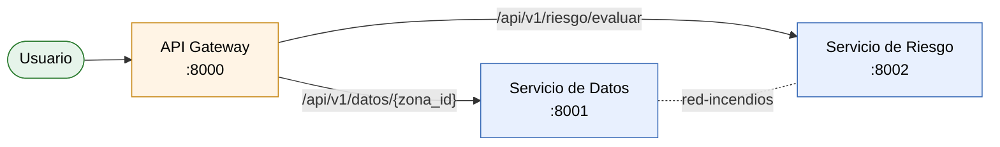

# Entrega — Microservicios de Riesgo de Incendios

Actividad grupal — Arquitectura de Sistemas de Inteligencia Artificial (DUOC).

Proyecto: riesgo de incendios forestales en la Región de Valparaíso.

---

## 1. Descripción breve

Se implementó una versión simple de la arquitectura de microservicios del proyecto. Está compuesta por tres servicios:

- **Servicio de Datos**: entrega las variables de una zona.
- **Servicio de Riesgo**: clasifica el nivel de riesgo (Bajo, Medio, Alto).
- **API Gateway**: recibe las solicitudes y las dirige al servicio correspondiente.

Los tres se ejecutan en contenedores separados dentro de la misma red de Docker.

---

## 2. Diagrama de la arquitectura



---

## 3. Responsabilidad de cada microservicio

| Servicio | Responsabilidad | Endpoint principal |
|---|---|---|
| Servicio de Datos | Entregar las variables ambientales de una zona (temperatura, humedad, viento, vegetación, incendios históricos). | `GET /datos/{zona_id}` |
| Servicio de Riesgo | Recibir las variables y devolver una clasificación de riesgo. | `POST /evaluar` |
| API Gateway | Ser el punto de entrada único y dirigir cada solicitud al servicio correcto. | `GET /health` |

El Gateway también expone las rutas públicas:

- `GET /api/v1/datos/{zona_id}` → redirige al Servicio de Datos.
- `POST /api/v1/riesgo/evaluar` → redirige al Servicio de Riesgo.

---

## 4. Endpoints

### Servicio de Datos (`http://localhost:8001`)

- `GET /datos/{zona_id}` — devuelve las variables de la zona.

### Servicio de Riesgo (`http://localhost:8002`)

- `POST /evaluar` — recibe un JSON con las variables y responde con el nivel de riesgo.

### API Gateway (`http://localhost:8000`)

- `GET /health` — comprueba que el Gateway está activo.
- `GET /api/v1/datos/{zona_id}` — proxy hacia el Servicio de Datos.
- `POST /api/v1/riesgo/evaluar` — proxy hacia el Servicio de Riesgo.

---

## 5. Ejecución

```bash
docker compose up --build -d
docker compose ps
```

Servicios disponibles:

- API Gateway: `http://localhost:8000`
- Servicio de Datos: `http://localhost:8001`
- Servicio de Riesgo: `http://localhost:8002`

---

## 6. Evidencias de pruebas

### 6.1 Servicios activos

Salida de `docker compose ps`:

```
NAME              STATUS
api-gateway       Up
servicio-datos    Up (healthy)
servicio-riesgo   Up (healthy)
```

### 6.2 Endpoint del Servicio de Datos

```
GET http://localhost:8001/datos/valparaiso-centro

zona_id              : valparaiso-centro
temperatura_c        : 29.5
humedad_porcentaje   : 28.0
viento_kmh           : 32.0
vegetacion           : Matorral seco
incendios_historicos : 6
```

### 6.3 Endpoint del Servicio de Riesgo

```
POST http://localhost:8002/evaluar

{ "temperatura_c": 29.5, "humedad_porcentaje": 28.0,
  "viento_kmh": 32.0, "vegetacion": "Matorral seco",
  "incendios_historicos": 6 }

Respuesta:
nivel_riesgo          : Alto
puntuacion_calculada  : 4
```

### 6.4 Solicitud a través del API Gateway

```
GET  http://localhost:8000/health
  → { "status": "ok", "servicio": "API Gateway" }

GET  http://localhost:8000/api/v1/datos/valparaiso-centro
  → variables de la zona

POST http://localhost:8000/api/v1/riesgo/evaluar
  → { "nivel_riesgo": "Alto", "puntuacion_calculada": 4 }
```

---

## 7. Relación con la arquitectura C4

**Nivel 2 — Contenedores**

Los tres contenedores Docker corresponden a los contenedores del diagrama C4:

- `api-gateway` — punto de entrada.
- `servicio-datos` — proveedor de datos.
- `servicio-riesgo` — evaluador.

La red `red-incendios` representa el canal de comunicación entre ellos. El usuario (navegador o cliente HTTP) es el actor externo.

**Nivel 3 — Componentes**

Dentro de cada contenedor:

- `servicio-datos`: diccionario en memoria con las zonas y el endpoint `GET /datos/{zona_id}`.
- `servicio-riesgo`: modelo `SolicitudEvaluacion` (Pydantic), función de cálculo de puntuación y endpoint `POST /evaluar`.
- `api-gateway`: cliente HTTP (`httpx`) y dos rutas proxy más la ruta `/health`.

---

## 8. Respuestas a las preguntas de la exposición

**1. ¿Qué responsabilidad tiene cada microservicio?**
Datos: entregar las variables de una zona. Riesgo: clasificar el nivel de riesgo. Gateway: enrutar las solicitudes al servicio correcto.

**2. ¿Por qué separaron esas responsabilidades?**
Porque cada servicio cambia por motivos distintos. El modelo de riesgo puede evolucionar sin tocar la fuente de datos, y viceversa.

**3. ¿Qué función cumple la API Gateway?**
Es el punto de entrada único al sistema. Oculta los servicios internos y centraliza las rutas y el manejo de errores.

**4. ¿Qué endpoint corresponde a cada microservicio?**
Datos: `GET /datos/{zona_id}`. Riesgo: `POST /evaluar`. Gateway: `GET /health` y las dos rutas proxy.

**5. ¿Qué diferencia existe entre un microservicio y un contenedor?**
El microservicio es una unidad de diseño con una responsabilidad acotada. El contenedor es la unidad de empaquetado y ejecución. Normalmente un microservicio se ejecuta en un contenedor, pero no son lo mismo.

**6. ¿Qué ocurriría si uno de los microservicios deja de funcionar?**
El Gateway responde `503 Service Unavailable` en las rutas que dependen de ese servicio. Los demás servicios siguen funcionando. Además, `depends_on` con `condition: service_healthy` evita que el Gateway arranque antes que los servicios de datos y riesgo estén listos.

**7. ¿En qué parte de la arquitectura C4 aparecen estos servicios?**
En el Nivel 2 como contenedores, y en el Nivel 3 como componentes internos de cada contenedor.

---

## 9. Conclusión

La actividad permitió implementar una arquitectura mínima de microservicios con API Gateway, separar responsabilidades entre servicios y verificar su funcionamiento en contenedores. La solución es simple y se puede extender más adelante (por ejemplo, reemplazando la regla de puntuación por un modelo de Machine Learning).